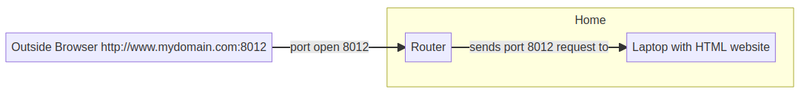
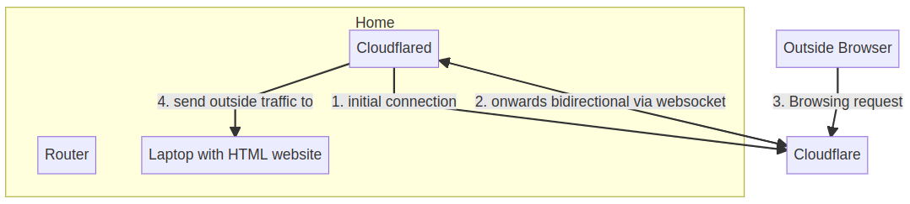

title: Cloudflare Tunnels
date: 2022-09-25
Category: Networking
Tags: security, dmz, vpn, noni
Summary: Exposing a website on home laptop to public without port forwarding (instead using cloudflare tunnels)

#### Normally:



Issues:

- You have opened port on your router (it is like leaving a door open of home)
- You must secure this open port heavily. If someone hacks your application (Website), the hacker will be inside your home network


#### Cloudflare solution:



Notes: 

- Cloudflared (a daemon) needs to run on your home network on some pc
- On routers, going outside traffic is allowed always. Incoming traffic is disallowed.
- Cloudflared outbound traffic is allowed
- Websocket is different from http, because it start from one side, but after starting, two-way traffic is allowed
- For #3: you need a domain name
- For #4: you need to tell cloudflared to send any incoming traffic to your laptop


### Steps

1. Get your own domain name or free dns name.
   
2. Create a cloudflare account > Home > Add a site > mysite.com > Choose free plan > DNS continue > Add records later + Confirm
   1. Note down nameservers from cloudflare:
      1. clark.ns.cloudflare.com
      2. liz.ns.cloudflare.com
3. On your domain registrar > Login > Set  Nameserver to above (cloudflare) nameservers.
4. Back to Cloudflare > Check nameservers > Finish later > Check nameservers  (it will be done in few mins - dont wait for it)
5. Creating cloudflare tunnel
   1. Access > Launch zero trust > Access > Tunnels > Create new tunnel e.g. mysite tunnel > Note the secret code (Tunnel token)
6. Go to portainer > Add new stack > use the docker compose script with the tunnel token as env variable
7. As soon as portainer stack is ready, cloudflare will show it. Press next
8. Choose a subdomain e.g. www
9. Choose your laptop website e.g. http://192.168.1.56:8000   for myhomewebsite e.g. hosted using python3 -m http.server  
10. Now browse from anywhere: www.mysite.com


**docker-compose script:**

```dockerfile
version: "2.1"

volumes:
  cloudflared_config:
  
services:
  heimdall:
    image: cloudflare/cloudflared
    container_name: cloudflared
    environment:
      - PUID=1000
      - PGID=1000
      - TZ=America/Chicago
    volumes:
      - cloudflared_config:/etc/cloudflared
    command: tunnel run
    environment:
      - TUNNEL_TOKEN=${TUNNEL_TOKEN}
    restart: unless-stopped
```

Volume may not be correct. May be /usr/local/etc/cloudflared  based on: https://github.com/cloudflare/cloudflared/blob/master/config/configuration.go

Direct docker run:

```bash
docker run cloudflare/cloudflared:latest tunnel --no-autoupdate run --token eyBlahBlahBlah123
```

