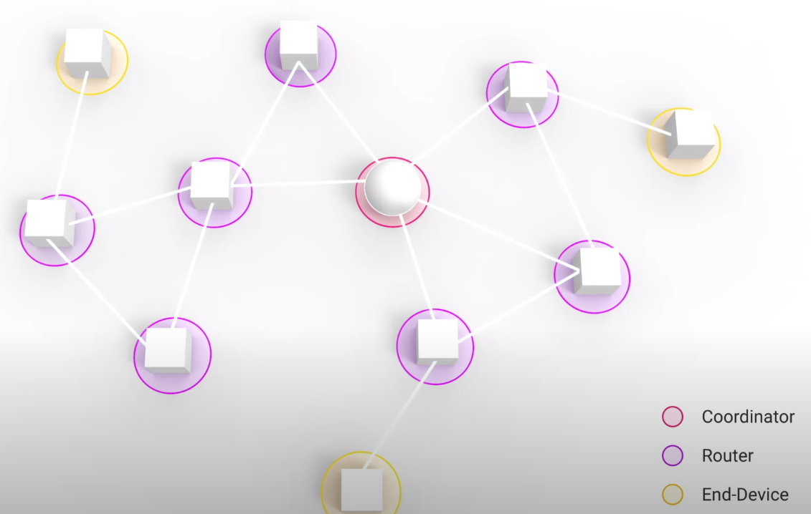

title: Zigbee2Mqtt Container
date: 2022-01-03
Category: IoT
Tags: mqtt, zigbee, zigbee2mqtt
Summary: Setting up zigbee2mqtt bridge


**Requires:**

zigbee dongle.
https://www.zigbee2mqtt.io/guide/adapters/#recommended
CC2652 usb dongle e.g. Sonoff Zigbee 3.0 (do not buy CC2531)

lsusb: 
```Bus 003 Device 005: ..... Silicon Labs CP210x UART Bridge```

**docker-compose:**

```dockerfile
version: '3.8'

volumes:
  zigbee2mqtt_data:
  
services:
  zigbee2mqtt:
    container_name: zigbee2mqtt
    restart: unless-stopped
    image: koenkk/zigbee2mqtt
    volumes:
      - zigbee2mqtt_data:/app/data
      - /run/udev:/run/udev:ro
    ports:
      - 8081:8081
    environment:
      - TZ=America/Chicago
    devices:
      - /dev/ttyUSB0:/dev/ttyUSB0
```

**First device:**

Paired ikea tradfri switch with it. Took few mins (and dev appear/disappear), and then zigbee2mqtt showed the switch as paired.

Enable homeassistant boolean in zigbee2mqtt yaml, after which it zigbee2mqtt published info about switch in mqtt. That mqtt discovery message was picked up home assistant and appeared as a device in MQTT integration. The friendly name configured in zigbee2mqtt web frontend also appeared in home assistant.

---

**Zigbee Architecture Notes:**




|                 | Coordinator                                        | Router                          | End-Device                   |
| --------------- | -------------------------------------------------- | ------------------------------- | ---------------------------- |
| Network role    | Administrator                                      | Signal Repeater, Range Extender | Leaf node                    |
| Primary Purpose | Administration, Security, Bridge to TCP/IP network | IoT Device                      | IoT Device                   |
| Cardinality     | One per network                                    | Multiple                        | Multiple                     |
| Communication   | Talks to multiple devices                          | Talks to multiple devices       | To one router or coordinator |
| Power Source    | Powered                                            | Powered                         | Battery Powered              |
| Example         | Zigbee hub e.g. phillips hue bridge                | Bulb                            | Wyze lock                    |
| Range           |                                                    | 10-20 m                         |                              |

