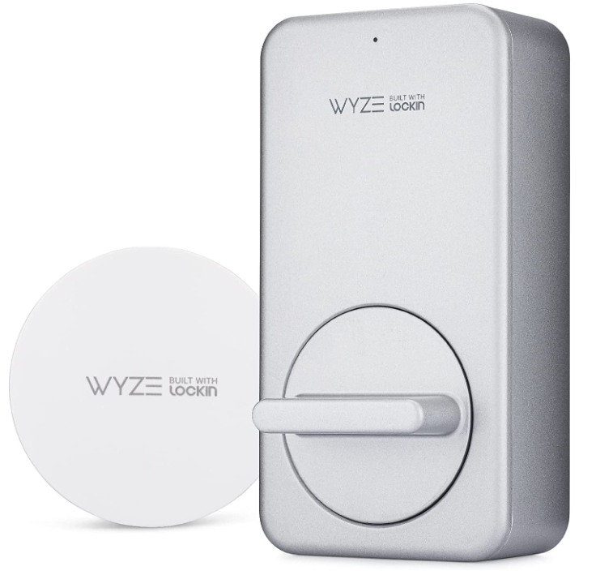
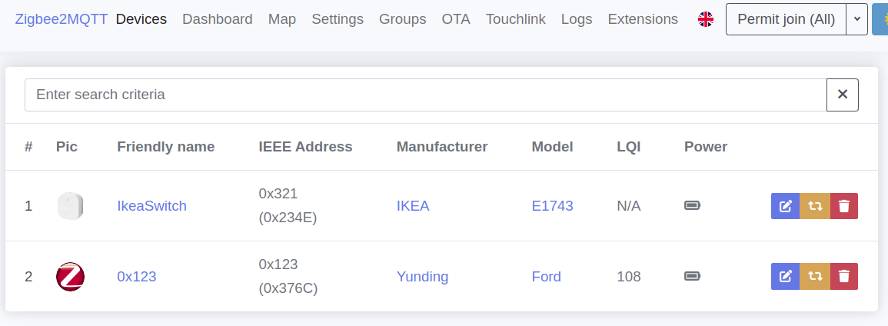
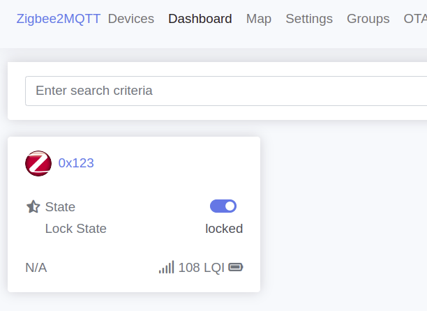
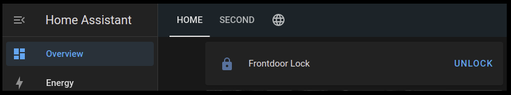

Title: Cloud-cutting: Wyze lock via Home Assistant
Date: 2022-11-29
Category: IoT
Tags: wyze lock, mqtt, zigbee, zigbee2mqtt
Summary: Using wyze lock without wyze cloud



**Prereq:**

- Wyze app for initial setup
- Zigbee Adapter e.g. CC2652 (Sonoff Zigbee 3.0)
- Zigbee2mqtt (e.g. [running in a container](container-zigbee2mqtt.md))

**Steps:**

1. Install wyze lock and setup/pair with gateway and wyze app as normal.
2. Put this code in zigbee container in this path: /app/data/wyzelock-converter.js   (or do it via volume on host)

```javascript
const fz = require('zigbee-herdsman-converters/converters/fromZigbee');
const tz = require('zigbee-herdsman-converters/converters/toZigbee');
const exposes = require('zigbee-herdsman-converters/lib/exposes');
const reporting = require('zigbee-herdsman-converters/lib/reporting');
const e = exposes.presets;

const definition = {
    zigbeeModel: ['Ford'],
    model: 'Ford',
    vendor: 'Yunding',
    description: 'Wyze Lock',
    fromZigbee: [fz.lock, fz.lock_operation_event, fz.battery],
    toZigbee: [tz.lock],
    meta: {configureKey: 1, options: {disableDefaultResponse: true}},
    configure: async (device, coordinatorEndpoint, logger) => {
        const endpoint = device.endpoints[0];
        await reporting.bind(endpoint, coordinatorEndpoint, ['closuresDoorLock', 'genPowerCfg']);
        await reporting.lockState(endpoint);
        await reporting.batteryPercentageRemaining(endpoint);
    },
    exposes: [e.lock(), e.battery()],
};

module.exports = definition;
```

3. In the same folder, edit configuration.yaml, adding these lines:

```
advanced:
  .... other existing lines go here ....
  log_level: debug
external_converters:
  - wyzelock-converter.js
```

3. Restart container
4. Put zigbee in pairing mode via web ui, and wyze lock in pairing mode (button behind faceplate).

The wyze gateway can be taken offline now.

Above steps will make the lock appear in zigbee web ui. Go to zigbee web ui > Dashboard and test lock/unlock function.





Also, it will appear automatically in mqtt and home assistant (under devices configuration). For home assistant, just add it to home screen.



ref:

- https://www.zigbee2mqtt.io/advanced/support-new-devices/01_support_new_devices.html
- https://github.com/Koenkk/zigbee2mqtt/issues/3018#issuecomment-1165982160

---

### MQTT comm

On mqtt broker, the unlock and lock events appear as:

```bash
TOPIC="zigbee2mqtt/0x123/#"
while true; do
	data=`mosquitto_sub -v -h ${MQTTSVR} -C 1 -t ${TOPIC}`
	echo $data
done
```

Output:

```json
zigbee2mqtt/0x123/set UNLOCK
zigbee2mqtt/0x123 {"battery":100,"linkquality":102,"lock_state":"unlocked","state":"UNLOCK"}
zigbee2mqtt/0x123/set LOCK
zigbee2mqtt/0x123 {"battery":100,"linkquality":99,"lock_state":"locked","state":"LOCK"}
```
